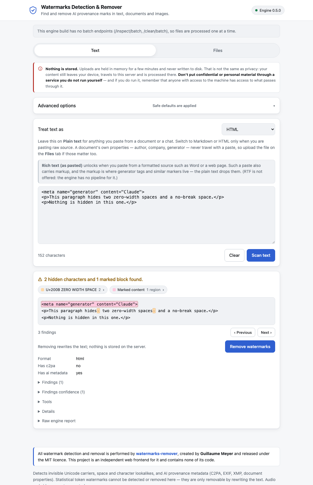

# Watermarks Detection & Remover GUI

A small, responsive web frontend for finding and removing AI provenance marks in
text, documents and images. Paste text or drop files in, see **exactly where the
marks are**, and remove them if you want to.



---

## Live demo

**[watermarks.hidden.ch](https://watermarks.hidden.ch)**

A running instance to try it on. Paste something in, watch it find the invisible
characters, remove them.

One thing to be clear about, because the application itself says it on every
page: that instance is **someone else's server**. Nothing is stored there, but
nothing being stored is not the same as nothing being seen — your content still
crosses the network and is processed on a machine you do not administer. Use the
demo to find out whether the tool is useful to you, and use the
[bundled examples](examples/) rather than real documents while you do. For
anything confidential, the whole stack is two containers and a `docker compose
up` away; see [Quick start](#quick-start).

---

## Credits

**All watermark detection and removal is performed by
[watermarks-remover](https://github.com/guillaumemeyer/watermarks-remover),
created by [Guillaume Meyer](https://github.com/guillaumemeyer) and released
under the MIT licence.** That project is the engine; everything clever about
finding a zero-width space in a PPTX or a C2PA manifest in an AVIF is its work.

This repository is an independent frontend. It contains **none** of the engine's
code — not a fork, not a vendored copy, not a reimplementation. It runs the
engine's own published container image and talks to its published HTTP API. The
credit is shown in the application footer as well as here.

---

## What it does

- **Text tab** — paste text, scan it, and see every hidden character marked in
  place with a colour-coded legend naming each one. Then remove them and copy
  the result.
- **Findings you can actually find** — each legend entry is a button that walks
  through its own occurrences, and previous/next controls step through them all
  in order. Invisible characters get a visible stand-in glyph; removed blocks of
  markup get a dashed outline, so a finding is never just a number.
- **Files tab** — drop up to 25 files at once, get a per-file verdict, expand any
  file for details, and download cleaned copies individually or as a ZIP.
- **Verified removal** — every cleaned file is run back through the engine and
  the result is reported honestly, including when the engine still flags it.
- **Nothing is stored.** Uploads live in memory for ten minutes and the
  containers run with read-only filesystems.

### A word on confidentiality

Nothing being stored is not the same as nothing being exposed. Whatever you scan
leaves your device, crosses the network to this server, and is processed by two
containers there. In memory, for a few minutes, on a machine someone
administers.

So: **do not put confidential or personal material through an instance you do
not run yourself** — the [live demo](#live-demo) included — and if you do run
one, remember that anyone with access to that machine, or to a proxy in front of
it, has access to what passes through.
The application says the same thing in a notice above the input, because a
reassuring "nothing is stored" badge is exactly the kind of thing that earns
trust it has not necessarily deserved.

### Supported formats

| Group | Formats |
| --- | --- |
| Images | PNG, JPEG, WebP, AVIF, HEIC/HEIF, BMP, GIF, TIFF |
| Documents | PDF, DOCX, XLSX, PPTX, EPUB, ODT |
| Markup & text | SVG, HTML, Markdown, plain text |

**Audio and video are deliberately not supported.** MP3, MP4, MOV, WAV and
friends are refused by extension *and* by content sniffing, so an MP3 renamed to
`.png` is rejected too, before anything reaches the engine.

### What it finds, and what it does not

Finds and removes:

- invisible Unicode carriers — zero-width spaces, joiners, bidirectional
  controls, tag characters, variation selectors, private-use characters;
- space and character lookalikes;
- AI provenance metadata — C2PA manifests, EXIF and XMP fields, `<meta
  generator>` tags, SVG `<metadata>` blocks, Office document properties.

### Pasting out of Word (measured against v0.5.0)

Word leaves a surprising amount behind in the clipboard. Two things are worth
knowing before you rely on a paste.

**A paste carries characters, not the document.** The plain-text clipboard
flavour has no author, company, "last modified by" or generator field in it —
those live in the `.docx` and stay there. If a Word file's *properties* are what
you care about, the Files tab is the right place, with the DOCX caveat noted
below.

**But a paste has more than one flavour.** Word also puts `text/html` on the
clipboard, and a textarea throws it away. The app keeps it, and offers it as a
**Rich text (as pasted)** entry in the picker. On the same Word paste it finds
one more thing than the plain path does —

```
plain text flavour : 3 findings  (zero-width space, no-break space, soft hyphen)
HTML flavour       : 4 findings  (the three above, plus
                                  <meta name=Generator content="Microsoft Word 15">)
```

The entry is always listed, so the capability is discoverable before anyone has
done the one thing that unlocks it — but it is only selectable once a paste has
actually carried a rich flavour, and it locks again as soon as you edit the box,
because the stored markup then no longer describes what is on screen. A note
under the picker says which of those two states you are in. Its cleaned output is
HTML markup, so for text you intend to paste back into a document, stay on Plain
text.

There is deliberately no RTF option: the engine has no RTF pipeline, so there
would be nothing to send it to. Note also that Word properties hidden inside
`<!--[if gte mso 9]>` conditional comments — author, company, last author — are
*not* flagged by the engine even in the HTML flavour.

**What the engine does with the characters it does get.** Verified by putting
each one through the running engine:

| Character | Default options |
| --- | --- |
| U+00A0 no-break space — Word inserts these constantly | replaced with a normal space |
| U+00AD soft hyphen — genuinely invisible | removed |
| U+200B zero-width space | removed |
| U+FEFF byte order mark mid-text | removed |
| U+F0B7 private use — Wingdings/Symbol bullets | removed |
| U+2009 thin space, U+3000 ideographic space | replaced |
| Curly quotes, en/em dash, ellipsis, U+2011 non-breaking hyphen | left alone — visible typography, not a hidden mark |

Turning on **Aggressive homoglyph replacement** additionally normalises the
non-breaking hyphen and the ellipsis, at the cost of rewriting legitimate
typography.

**Gaps to be aware of.** These pass through untouched even though they are
invisible: `U+000B` (Word's Shift+Enter line break), `U+2028` line separator,
`U+FFFC` object replacement (left over from an embedded object), and the legacy
Word `U+001E`/`U+001F` hyphens. They are the engine's call, not this app's — it
reports exactly what the engine does and never adds detection of its own, which
is the same property that lets the engine be upgraded underneath it.

Does **not** handle statistical (token-sampling) watermarks such as SynthID-Text.
Those live in the choice of words itself and can only be removed by rewriting the
text with a language model. The engine supports that separately; this GUI leaves
it out on purpose, so it needs no model, no API key, and sends your content
nowhere.

---

## Quick start

Requires Docker. Nothing else — no Node, no Python, no build step.

```bash
cp .env.example .env
docker compose up -d --build
open http://127.0.0.1:8080
```

Try it with the bundled examples:

```bash
python3 examples/make-binary-examples.py   # generates the PNG and DOCX
./examples/demo.sh                          # end-to-end smoke test
```

Stop it with `docker compose down`.

### Files you may want to edit

| File | Purpose |
| --- | --- |
| `.env.example` → `.env` | every setting, all optional, all commented |
| `docker-compose.yml` | the working stack; runs as-is |
| `docker-compose.yml-example` | annotated reference copy with the common variations |

---

## Staying current with the engine

The engine is a separate project on its own release schedule. This frontend is
built to survive that, in four ways.

**1. Pinned by tag, not vendored.** `docker-compose.yml` references
`ghcr.io/guillaumemeyer/watermarks-remover:${WR_CORE_TAG}` and has no build
context for it. Upgrading is a tag bump in `.env` followed by
`docker compose pull && docker compose up -d`. There is nothing to merge, patch
or rebuild.

> Upstream keeps only the newest version tag plus `latest`, so a pinned tag can
> be pruned. If that happens the pull fails loudly rather than silently
> upgrading you — bump `WR_CORE_TAG` to the version the UI reports.

**2. A startup contract check.** On boot the app reads the engine's own
`/openapi.json` and verifies that the routes and options it depends on still
exist. A mismatch produces a banner naming exactly what changed, and the app
keeps running. This is not theoretical: the released v0.5.0 image has no batch
endpoints, and the app detected that and fell back to per-file calls on its own.

**3. Options driven by the engine, not hardcoded.** The Advanced panel is built
from the option list the engine currently advertises. An option dropped upstream
disappears from the UI and stops being sent; an option added upstream is reported
so you know it exists.

**4. A daily update check.** The UI compares the running engine against the
newest GitHub release and shows a banner when a newer one is available. This is
the app's only outbound connection; set `GUI_UPDATE_CHECK=0` to run fully
offline.

Because two version numbers are in play and they are easy to confuse, the footer
labels them rather than running them together:

```
This app   watermarks-remover-gui v1.0.0 · by Steven Glogger
Engine     watermarks-remover v0.5.0 · up to date · http://wr-core:8765
```

---

## How "show me where the marks are" works

The engine's inspect report caps positions at ten sample offsets per character
type — enough to say *what* is in a file, not enough to mark *every* occurrence.

So the app asks the engine to clean the content and derives the positions from
the difference between original and cleaned. Whatever the engine treats as a
watermark today, the diff finds, without this project ever needing a copy of its
character tables. The comparison is a linear two-pointer alignment that verifies
itself by replaying its own result, falling back to `difflib` when a transform is
not one-to-one.

Two consequences worth knowing:

- **It is more complete than the report.** The engine's container inspector
  reports metadata findings but does not scan for invisible characters, so a
  Markdown file full of zero-width spaces comes back "not suspicious" — while its
  cleaner strips eight of them. The diff catches those; the report alone would
  not.
- **Findings are of two kinds.** Hidden characters are counted individually and
  marked with a visible stand-in glyph. Removed blocks of ordinary visible
  content — an AI `<meta generator>` tag, an SVG `<metadata>` element — are
  counted as regions, because describing one deleted element as "148 characters"
  helps nobody.

Formats whose cleaned output is still text (`.txt`, `.md`, `.html`, `.svg`) get
in-place highlighting. Images, PDFs and Office documents cannot be marked up in
place, so they get a findings list instead.

Nothing is cleaned on your behalf without asking: the cleaned bytes are computed
server-side to locate the marks, held in memory, and only returned when you press
Remove.

### Engine limitations you will meet

The frontend reports what the engine actually does, including when that falls
short. Two examples found while testing against v0.5.0, both upstream behaviour
rather than bugs here:

- **DOCX**: the engine detects an AI marker in `docProps/core.xml` but does not
  remove it under any option, and it does not apply invisible-character cleaning
  to the document body. Files come back marked "still flagged", with the
  engine's own explanation shown underneath.
- **Container inspection**: `/inspect` on Markdown, HTML and SVG reports metadata
  findings only. Invisible characters are found by the diff described above, not
  by the report.

---

## Configuration

All settings are optional; the stack runs with an empty `.env`. See
`.env.example` for the annotated list. The ones that matter most:

| Variable | Default | Purpose |
| --- | --- | --- |
| `WR_CORE_TAG` | `v0.5.0` | engine image tag |
| `WR_CORE_PLATFORM` | `linux/amd64` | upstream publishes amd64 only; arm64 hosts emulate |
| `GUI_HOST_BIND` / `GUI_HOST_PORT` | `127.0.0.1` / `8080` | where the UI is published |
| `GUI_AUTH_TOKEN` | *(empty)* | shared secret; empty means no login |
| `GUI_RATE_LIMIT_PER_MIN` | `0` | per-address request limit on `/api/`; 0 disables |
| `WATERMARKS_SERVER_API_KEY` | *(empty)* | bearer token for the engine; never reaches the browser |
| `GUI_MAX_UPLOAD_MB` / `GUI_MAX_FILES` | `32` / `25` | upload limits |
| `GUI_CACHE_TTL` / `GUI_CACHE_MAX_MB` | `600` / `256` | in-memory scan cache |
| `GUI_UPDATE_CHECK` | `1` | daily release check; 0 for offline |
| `WATERMARKS_MAX_BATCH_FILES` | `50` | engine's per-request file cap; the GUI chunks to match |
| `GUI_LOG_LEVEL` | `INFO` | log verbosity of the GUI process |

Four more exist for cases you are unlikely to hit — `WR_CORE_TIMEOUT`,
`WR_CORE_URL`, `GUI_RELEASES_URL`, and the in-container `GUI_BIND` / `GUI_PORT`.
They are commented out at the bottom of `.env.example` with an explanation of
when each one matters.

### Exposing it beyond this machine

The default binds to `127.0.0.1` and has no login, which is right for a local
tool. Before putting it on a network:

```dotenv
GUI_HOST_BIND=0.0.0.0
GUI_AUTH_TOKEN=<openssl rand -base64 32>
GUI_RATE_LIMIT_PER_MIN=60
```

The auth layer, rate limiter, security headers and a strict Content-Security
Policy are already in place; those two variables switch on the first two. Put it
behind TLS as well — the login token is sent in a cookie.

---

## Architecture

```
Browser ──► wr-gui (FastAPI, :8080) ──► wr-core (upstream image, :8765)
            translates multipart to        unmodified, not published
            the engine's base64 JSON       to the host
            hides the engine API key
            enforces the format allowlist
            computes highlight positions
            optional auth and rate limit
```

The proxy is not optional: the engine sends no CORS headers and has no `OPTIONS`
handler, so a browser cannot call it directly — and its API key would be exposed
if it could.

### HTTP API

The frontend is the intended way in, but the API is small, stable and pleasant
to script against — `examples/demo.py` uses nothing else.

| Route | Purpose |
| --- | --- |
| `GET /api/status` | engine health and version, contract-check result, update info, this app's own version |
| `GET /api/formats` | accepted extensions, limits and the current option list |
| `POST /api/scan/text` | `{text, format, options}` — scan pasted text |
| `POST /api/scan/files` | multipart upload — scan files |
| `POST /api/clean` | `{ids, options}` — clean previously scanned items and re-verify them |
| `GET /api/download/{id}` | cleaned bytes for one item |
| `GET /api/download.zip?ids=…` | cleaned bytes for several, as a ZIP |
| `POST /api/login` | exchange `GUI_AUTH_TOKEN` for a session cookie (only when auth is on) |
| `GET /api/ping` | liveness; also reports whether auth is required |

### Layout

| Path | Contents |
| --- | --- |
| `app/` | FastAPI backend — `upstream.py` is the only module that knows the engine's wire format |
| `web/` | frontend: one HTML file, one stylesheet, one script, no framework, no build |
| `examples/` | sample files and an end-to-end smoke test |
| `tests/` | pytest suite against a fake engine |

---

## Development

```bash
python3 -m venv .venv && ./.venv/bin/pip install -r requirements-dev.txt
./.venv/bin/python -m pytest
```

The suite runs against a stand-in engine (`tests/fake_engine.py`) rather than a
container, so it needs no Docker and finishes in under a second. To work on the
frontend without rebuilding the image, mount it live:

```bash
docker compose -f docker-compose.yml -f - up -d <<'YAML'
services:
  wr-gui:
    volumes: [./web:/srv/web:ro]
YAML
```

---

## Changelog

Version history is in [CHANGELOG.md](CHANGELOG.md). It covers this frontend
only — the engine has its own releases, and the version this stack runs is
pinned by `WR_CORE_TAG` and shown in the application footer.

## Licence

This frontend is MIT licensed. The engine it runs,
[watermarks-remover](https://github.com/guillaumemeyer/watermarks-remover) by
Guillaume Meyer, is separately MIT licensed and is used unmodified as a published
container image.
