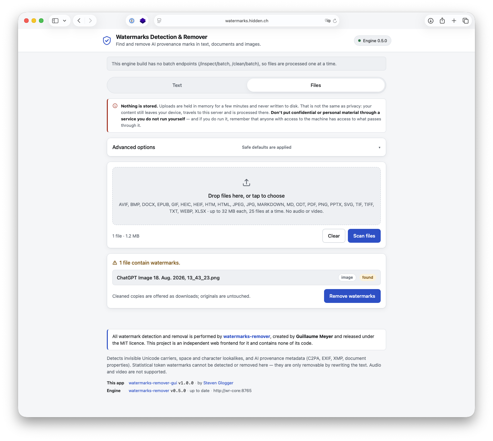

# Watermarks Detection & Remover GUI

A small, responsive web frontend for finding and removing AI provenance marks in
text, documents and images. Paste text or drop files in, see **exactly where the
marks are**, and remove them if you want to.



---

## Live demo

**[watermarks.hidden.ch](https://watermarks.hidden.ch)**

A running instance to try it on. Paste something in, watch it find the invisible
characters, remove them.

One thing to be clear about, because the application itself says it on every
page: that instance is **someone else's server**. Nothing is stored there, but
nothing being stored is not the same as nothing being seen — your content still
crosses the network and is processed on a machine you do not administer. Use the
demo to find out whether the tool is useful to you, and use the
[bundled examples](examples/) rather than real documents while you do. For
anything confidential, the whole stack is two containers and a `docker compose
up` away; see [Quick start](#quick-start).

---

## Credits

**All watermark detection and removal is performed by
[watermarks-remover](https://github.com/guillaumemeyer/watermarks-remover),
created by [Guillaume Meyer](https://github.com/guillaumemeyer) and released
under the MIT licence.** That project is the engine; everything clever about
finding a zero-width space in a PPTX or a C2PA manifest in an AVIF is its work.

This repository is an independent frontend. It contains **none** of the engine's
code — not a fork, not a vendored copy, not a reimplementation. It runs the
engine's own published container image and talks to its published HTTP API. The
credit is shown in the application footer as well as here.

---

## What it does

- **Text tab** — paste text, scan it, and see every hidden character marked in
  place with a colour-coded legend naming each one. Then remove them and copy
  the result.
- **Findings you can actually find** — each legend entry is a button that walks
  through its own occurrences, and previous/next controls step through them all
  in order. Invisible characters get a visible stand-in glyph; removed blocks of
  markup get a dashed outline, so a finding is never just a number.
- **Files tab** — drop up to 25 files at once, get a per-file verdict, expand any
  file for details, and download cleaned copies individually or as a ZIP.
- **Verified removal** — every cleaned file is run back through the engine and
  the result is reported honestly, including when the engine still flags it.
- **Nothing is stored.** Uploads live in memory for ten minutes and the
  containers run with read-only filesystems.

### A word on confidentiality

Nothing being stored is not the same as nothing being exposed. Whatever you scan
leaves your device, crosses the network to this server, and is processed by two
containers there. In memory, for a few minutes, on a machine someone
administers.

So: **do not put confidential or personal material through an instance you do
not run yourself** — the [live demo](#live-demo) included — and if you do run
one, remember that anyone with access to that machine, or to a proxy in front of
it, has access to what passes through.
The application says the same thing in a notice above the input, because a
reassuring "nothing is stored" badge is exactly the kind of thing that earns
trust it has not necessarily deserved.

### Supported formats

| Group | Formats |
| --- | --- |
| Images | PNG, JPEG, WebP, AVIF, HEIC/HEIF, BMP, GIF, TIFF |
| Documents | PDF, DOCX, XLSX, PPTX, EPUB, ODT |
| Markup & text | SVG, HTML, Markdown, plain text |

**Audio and video are deliberately not supported.** MP3, MP4, MOV, WAV and
friends are refused by extension *and* by content sniffing, so an MP3 renamed to
`.png` is rejected too, before anything reaches the engine. The engine itself
*can* handle media — since v0.6.0 it strips AI and C2PA metadata from MP4/MOV,
WAV, MP3 and FLAC, and v0.7.0 added a destructive audio cleaning chain and
per-frame video purification — so this is a scope decision by this frontend, not
a limit of the engine. Use the engine's own CLI for media files.

### What it finds, and what it does not

Finds and removes:

- invisible Unicode carriers — zero-width spaces, joiners, bidirectional
  controls, tag characters, variation selectors, private-use characters, and
  since engine v0.6.0 the noncharacters, reserved default-ignorables and
  blank-rendering fillers that render as nothing but sit outside every
  "invisible" Unicode category;
- space and character lookalikes;
- AI provenance metadata — C2PA manifests, EXIF and XMP fields, `<meta
  generator>` tags, SVG `<metadata>` blocks, Office document properties, and
  since engine v0.7.0 the C2PA provenance box inside AVIF and HEIC images;
- **statistical watermarks in plain text**, if — and only if — the engine has a
  Layer B rewrite backend configured. These live in word choice rather than in
  characters, so removing them means rewriting the prose; see
  [Cleaning plain text needs a rewrite backend](#cleaning-plain-text-needs-a-rewrite-backend).

Reports what it finds by **evidence class**, rather than as a single verdict.
Engine v0.7.0 separates observable provenance metadata, invisible Unicode
carriers, a scheme-specific detector hit and a stylometric score, because they
are not comparable: an embedded C2PA manifest is a fact about the file, while a
stylometry score is a guess about its author. The scan lists whichever fired,
strongest first.

### Cleaning plain text needs a rewrite backend

This is the one thing about engine v0.7.0 that changes what the tool can do out
of the box, so it is worth understanding before you hit it.

Watermarks come in two layers. **Layer A** is characters: zero-width spaces,
joiners, lookalikes. Removing those is deterministic, needs no model, and is
what this GUI has always done. **Layer B** is word choice — a statistical
watermark biases which synonyms a model picks, and no amount of character
scrubbing touches it. Removing *that* means rewriting the prose.

v0.7.0 made Layer B a **required** step for anything the engine classifies as
plain text, and refuses the request with a 400 rather than handing back text
that is still marked. The published engine image ships no strategy config, no
`transformers` and no LLM, so out of the box:

| | Scan | Remove |
| --- | --- | --- |
| Plain text (`.txt`, the Plain text box) | works | **needs a rewrite backend** |
| Markdown, HTML, SVG | works | works |
| PDF, DOCX, XLSX, PPTX, ODT, EPUB | works | works |
| Images | works | works |

Scanning is never affected — it does not clean anything. And every format other
than plain text goes through the container or image pipeline, which has no Layer
B at all. If you never clean a `.txt`, you can ignore this section entirely; the
app will tell you if you do hit it, and say what to set.

**To enable it**, point the engine at an LLM in `.env`:

```bash
WATERMARKS_REWRITE_BACKEND=ollama          # or openai-compatible
WATERMARKS_REWRITE_BASE_URL=http://host.docker.internal:11434
WATERMARKS_REWRITE_MODEL=llama3.1
WATERMARKS_REWRITE_ALLOW_REMOTE=1          # see below
# openai-compatible also needs WATERMARKS_REWRITE_API_KEY
```

`WATERMARKS_REWRITE_ALLOW_REMOTE` is not a formality. The engine refuses a
non-loopback rewrite endpoint unless it is set, so that document text cannot be
shipped to a third party by accident — and **from inside the container, your own
host is not loopback**, so reaching Ollama on your own machine needs it too.
That flag is also the moment to notice that enabling Layer B means your text is
sent to whatever endpoint you configured. A local Ollama keeps it on the
machine; a hosted API does not.

The default strategy lives in `config/clean_strategy.json`, mounted into the
engine read-only by `docker-compose.yml`, and the Advanced panel can override it
per request. A strategy is an ordered list of `tactic@intensity` steps, e.g.
`paraphrase@0.8,mlm@0.2`:

| Tactic | Needs |
| --- | --- |
| `paraphrase`, `backtranslate`, `structural`, `humanize`, `code`, `chunk` | the LLM backend above |
| `mlm` | `transformers` inside the engine image, which the published one lacks |

Intensity runs from just above 0 to 1. A mistyped tactic is caught here and
reported beside the field, rather than becoming a failed clean.

**What Layer B does to your document:** it rewrites the wording. Meaning and
facts are preserved as far as the model manages; the sentences are not. That is
a much larger edit than removing invisible characters, which is why the option
carries a warning in the panel and why plain text is the only pipeline that gets
it.

### Pasting out of Word (measured against v0.5.0)

Word leaves a surprising amount behind in the clipboard. Two things are worth
knowing before you rely on a paste.

**A paste carries characters, not the document.** The plain-text clipboard
flavour has no author, company, "last modified by" or generator field in it —
those live in the `.docx` and stay there. If a Word file's *properties* are what
you care about, the Files tab is the right place, with the DOCX caveat noted
below.

**But a paste has more than one flavour.** Word also puts `text/html` on the
clipboard, and a textarea throws it away. The app keeps it, and offers it as a
**Rich text (as pasted)** entry in the picker. On the same Word paste it finds
one more thing than the plain path does —

```
plain text flavour : 3 findings  (zero-width space, no-break space, soft hyphen)
HTML flavour       : 4 findings  (the three above, plus
                                  <meta name=Generator content="Microsoft Word 15">)
```

The entry is always listed, so the capability is discoverable before anyone has
done the one thing that unlocks it — but it is only selectable once a paste has
actually carried a rich flavour, and it locks again as soon as you edit the box,
because the stored markup then no longer describes what is on screen. A note
under the picker says which of those two states you are in. Its cleaned output is
HTML markup, so for text you intend to paste back into a document, stay on Plain
text.

There is deliberately no RTF option: the engine has no RTF pipeline, so there
would be nothing to send it to. Note also that Word properties hidden inside
`<!--[if gte mso 9]>` conditional comments — author, company, last author — are
*not* flagged by the engine even in the HTML flavour.

**What the engine does with the characters it does get.** Verified by putting
each one through the running engine:

| Character | Default options |
| --- | --- |
| U+00A0 no-break space — Word inserts these constantly | replaced with a normal space |
| U+00AD soft hyphen — genuinely invisible | removed |
| U+200B zero-width space | removed |
| U+FEFF byte order mark mid-text | removed |
| U+F0B7 private use — Wingdings/Symbol bullets | removed |
| U+2009 thin space, U+3000 ideographic space | replaced |
| Curly quotes, en/em dash, ellipsis, U+2011 non-breaking hyphen | left alone — visible typography, not a hidden mark |

Turning on **Aggressive homoglyph replacement** additionally normalises the
non-breaking hyphen and the ellipsis, at the cost of rewriting legitimate
typography.

**Gaps to be aware of.** These pass through untouched even though they are
invisible: `U+000B` (Word's Shift+Enter line break), `U+2028` line separator,
`U+FFFC` object replacement (left over from an embedded object), and the legacy
Word `U+001E`/`U+001F` hyphens. They are the engine's call, not this app's — it
reports exactly what the engine does and never adds detection of its own, which
is the same property that lets the engine be upgraded underneath it.

Does **not** handle statistical (token-sampling) watermarks such as SynthID-Text.
Those live in the choice of words itself and can only be removed by rewriting the
text with a language model. The engine supports that separately; this GUI leaves
it out on purpose, so it needs no model, no API key, and sends your content
nowhere.

---

## Quick start

Requires Docker. Nothing else — no Node, no Python, no build step.

```bash
cp .env.example .env
cp docker-compose.yml-example docker-compose.yml
docker compose up -d --build
open http://127.0.0.1:8080
```

Try it with the bundled examples:

```bash
python3 examples/make-binary-examples.py   # generates the PNG and DOCX
./examples/demo.sh                          # end-to-end smoke test
```

Stop it with `docker compose down`.

### Files you may want to edit

| File | Purpose |
| --- | --- |
| `.env.example` → `.env` | every setting, all optional, all commented |
| `docker-compose.yml-example` → `docker-compose.yml` | the stack; the copy is yours to edit and is not tracked, so local changes never land in a commit |

Both working copies are gitignored on purpose: they are where your deployment
differs from the repository, and the examples they come from carry the
annotations explaining what you may want to change.

---

## Staying current with the engine

The engine is a separate project on its own release schedule. This frontend is
built to survive that, in four ways.

**1. Pinned by tag, not vendored.** `docker-compose.yml` references
`ghcr.io/guillaumemeyer/watermarks-remover:${WR_CORE_TAG}` and has no build
context for it. Upgrading is a tag bump in `.env` followed by
`docker compose pull && docker compose up -d`. There is nothing to merge, patch
or rebuild.

> Upstream keeps only the newest version tag plus `latest`, so a pinned tag can
> be pruned. If that happens the pull fails loudly rather than silently
> upgrading you — bump `WR_CORE_TAG` to the version the UI reports.

**2. A startup contract check.** On boot the app reads the engine's own
`/openapi.json` and verifies that the routes and options it depends on still
exist. A mismatch produces a banner naming exactly what changed, and the app
keeps running. This is not theoretical, and it has now been proved in both
directions: v0.5.0 had no batch endpoints, and the app detected that and fell
back to per-file calls on its own; v0.6.0 added them, and the app picked them up
without a code change. The same check surfaced `deep_images` the day v0.6.0
landed, which is how it came to be in the Advanced panel.

**3. Options driven by the engine, not hardcoded.** The Advanced panel is built
from the option list the engine currently advertises, including each option's
type — a checkbox for a boolean, a picker for a string enum such as v0.6.0's
`deep_images`, a text field for a free-form string such as v0.7.0's `strategy`.
An option dropped upstream disappears from the UI and stops being sent; an
option added upstream is reported so you know it exists. Where an option needs
something the engine image does not ship, the panel says so: the published image
has no Ghostscript, so the PDF deep-image pass reports itself as skipped
whichever value you pick, and it configures no watermark detectors, so the
scoring options say that too.

**4. A daily update check.** The UI compares the running engine against the
newest GitHub release and shows a banner when a newer one is available. This is
the app's only outbound connection; set `GUI_UPDATE_CHECK=0` to run fully
offline.

Because two version numbers are in play and they are easy to confuse, the footer
labels them rather than running them together:

```
This app   watermarks-remover-gui v1.2.0 · by Steven Glogger
Engine     watermarks-remover v0.7.0 · up to date · http://wr-core:8765
```

**Not everything a release changes is something a contract check can catch.**
The four mechanisms above cover routes and options. They do not cover a field
that keeps its name and changes its *shape* — and v0.7.0 did exactly that, when
`suspicious` went from a boolean to an evidence object. Nothing 400'd; the app
simply started calling every file watermarked, because a dict is truthy. Both
shapes are read correctly now, and the case is pinned by a test, but it is worth
knowing that a green contract banner means the routes match, not that every
answer is being read the way the engine means it.

---

## How "show me where the marks are" works


The engine's inspect report caps positions at ten sample offsets per character
type — enough to say *what* is in a file, not enough to mark *every* occurrence.
There are two ways to get past that, and the app uses each where it fits.

**Markdown, HTML and SVG: diff the clean.** The app asks the engine to clean the
content and derives the positions from the difference between original and
cleaned. Whatever the engine treats as a watermark today, the diff finds,
without this project ever needing a copy of its character tables. The comparison
is a linear two-pointer alignment that verifies itself by replaying its own
result, falling back to `difflib` when a transform is not one-to-one.

This is more complete than the report: the engine's container inspector reports
metadata findings but does not scan for invisible characters, so a Markdown file
full of zero-width spaces comes back "not suspicious" — while its cleaner strips
eight of them. The diff catches those; the report alone would not.

**Plain text: read the report.** Engine v0.7.0 made the Layer B rewrite a
mandatory part of cleaning anything it classifies as text, so the diff route is
no longer available there — asking for cleaned bytes would either be refused
outright or spend an LLM paraphrase of the whole document on a preview, and then
return a diff of the entire file rather than the watermark.

So for plain text the app goes back to the report and scans for the code points
it named. That is exact and complete (the *offsets* are sampled, the code points
are not), it costs nothing, and it works with no rewrite backend configured. The
one thing it cannot know is which occurrences the engine would spare as
load-bearing — emoji glue, script joiners — so a plain-text scan shows what
inspection found, which is a slightly wider net than what cleaning would remove.
A useful side effect: scanning pasted text no longer depends on `/clean` being
up at all.

**Findings are of two kinds**, either way. Hidden characters are counted
individually and marked with a visible stand-in glyph. Removed blocks of
ordinary visible content — an AI `<meta generator>` tag, an SVG `<metadata>`
element — are counted as regions, because describing one deleted element as "148
characters" helps nobody.

Formats whose cleaned output is still text (`.txt`, `.md`, `.html`, `.svg`) get
in-place highlighting. Images, PDFs and Office documents cannot be marked up in
place, so they get a findings list instead.

Nothing is cleaned on your behalf without asking: where cleaned bytes are
computed server-side to locate the marks, they are held in memory and only
returned when you press Remove.

### The optional metadata check (`GUI_EXIFTOOL=1`)

Off by default. Switched on, the GUI runs its own `exiftool` over images, PDF,
OOXML, ODT and EPUB **after** the engine has inspected them, and lists what it
finds beside the engine's report — never merged into it, because the two are
separate opinions and the disagreement is the point.

It exists because of a measured gap. The engine ships exiftool and calls it
(`/capabilities` reports `exiftool: true`, and a PDF report carries a
`tools.exiftool` block), but hands back only a couple of lines it judged
interesting. Against a PDF whose Info dictionary held `/Producer`, `/Author` and
`/Keywords`, the engine returned `findings: []` and `suspicious: false` while
exiftool named all three. The engine says so itself, in a note it attaches to
every PDF: *"PDF inspection is best-effort; exiftool/c2patool give more reliable
metadata detection."*

A flagged tag makes a file suspicious in its own right, so a PDF that carries
nothing but an author name is now offered for removal instead of showing as
clean. Only identity-bearing tags count — author, producer, GPS, C2PA, document
IDs, device serials, the IPTC AI marker and free-text fields. A photo's exposure
time is metadata but identifies nobody, so it is listed separately and changes
no verdict.

The same check runs again on the cleaned bytes, which is where it earns its
keep. Measured against v0.6.0: a PNG carrying EXIF, XMP and PNG text chunks
comes back with EXIF and GPS gone but `PNG:Author`, `PNG:Artist`,
`PNG:Copyright`, `PNG:Software`, `XMP:CreatorTool` and `XMP:XMPToolkit` intact —
and the engine's own re-inspection reports `findings: []`, i.e. verified clean.
With the check on, that file is reported as **still flagged**, naming each
surviving tag.

The trade is deliberate: this runs a third-party binary over untrusted uploads,
which is work the engine otherwise isolates inside its own container, and
exiftool has a CVE history. That is why it is opt-in. Bytes are piped in on
stdin, so nothing is written to disk either way, and the container's read-only
root filesystem stays read-only.

---

### Engine limitations you will meet

The frontend reports what the engine actually does, including when that falls
short. All of the following was re-measured against a running v0.7.0 engine, the
version this stack pins.

**Fixed since v0.5.0:**

- **DOCX**: the engine used to detect an AI marker in `docProps/core.xml` and
  remove it under no option, so files came back "still flagged". v0.6.0 empties
  the `docProps` provenance fields and runs Layer A over DOCX and ODT body text.
  `examples/sample-marked.docx` now verifies clean.
- **Markdown and HTML inspection**: `/inspect` used to report metadata findings
  only. v0.6.0 added a `layer_a_hits` list to container reports, so invisible
  characters in those formats are named by the engine itself. The app reads that
  list, which is why a finding in a `.md` or `.html` file now carries the
  engine's own label rather than one derived from the Unicode database.

**Still true under v0.7.0** — both re-measured against the running engine, not
carried over from the last release:

- **SVG gets no Layer A pass.** The SVG pipeline handles metadata and embedded
  images; it neither reports nor removes invisible characters in the markup.
  `examples/sample-marked.svg` carries a zero-width space and a no-break space,
  and the engine reports `suspicious_total: 0` and an empty `layer_a_hits` for
  it — the app shows the `<metadata>` block it does remove, and the two
  characters survive unmentioned. Re-inspecting the cleaned file returns a
  *negative* verdict while both characters are still in it. This is the one
  place where "verified clean" means "the engine has nothing more to say", not
  "nothing is left".
- **Bidirectional marks are reported but deliberately kept.** The engine treats
  RTL directional marks as load-bearing, so `/inspect` flags a `U+200E` and
  `/clean` leaves it in place. A file whose only remaining finding is a bidi
  mark therefore comes back **still flagged** by design, and the app says so
  rather than quietly calling it clean — `examples/sample-marked.md` is exactly
  this case, and still re-inspects with one finding left after cleaning.

**New in v0.7.0:** cleaning plain text requires a rewrite backend the published
image does not have — see [Cleaning plain text needs a rewrite
backend](#cleaning-plain-text-needs-a-rewrite-backend). It is the only
limitation here that configuration can remove.

The diff described above has not become redundant for the formats that still use
it. It finds every occurrence rather than the engine's ten sampled offsets, and
it is still what catches a carrier the container report does not mention — which
is exactly the SVG and Markdown cases above.

---

## Configuration

All settings are optional; the stack runs with an empty `.env`. See
`.env.example` for the annotated list. The ones that matter most:

| Variable | Default | Purpose |
| --- | --- | --- |
| `WR_CORE_TAG` | `v0.7.0` | engine image tag |
| `WR_CORE_PLATFORM` | `linux/amd64` | upstream publishes amd64 only; arm64 hosts emulate |
| `GUI_HOST_BIND` / `GUI_HOST_PORT` | `127.0.0.1` / `8080` | where the UI is published |
| `GUI_AUTH_TOKEN` | *(empty)* | shared secret; empty means no login |
| `GUI_RATE_LIMIT_PER_MIN` | `0` | per-address request limit on `/api/`; 0 disables |
| `WATERMARKS_SERVER_API_KEY` | *(empty)* | bearer token for the engine; never reaches the browser |
| `GUI_MAX_UPLOAD_MB` / `GUI_MAX_FILES` | `32` / `25` | upload limits |
| `GUI_CACHE_TTL` / `GUI_CACHE_MAX_MB` | `600` / `256` | in-memory scan cache |
| `GUI_EXIFTOOL` | `0` | local exiftool second opinion on container metadata |
| `GUI_UPDATE_CHECK` | `1` | daily release check; 0 for offline |
| `WATERMARKS_MAX_BATCH_FILES` | `50` | engine's per-request file cap; the GUI chunks to match |
| `GUI_LOG_LEVEL` | `INFO` | log verbosity of the GUI process |

Cleaning plain text needs the engine's Layer B rewrite, which is off until you
configure it. These are passed straight through to the engine container:

| Variable | Default | Purpose |
| --- | --- | --- |
| `WATERMARKS_REWRITE_BACKEND` | *(empty)* | `ollama` or `openai-compatible`; empty disables plain-text cleaning |
| `WATERMARKS_REWRITE_BASE_URL` | *(empty)* | where that backend listens |
| `WATERMARKS_REWRITE_MODEL` | *(empty)* | model name to rewrite with |
| `WATERMARKS_REWRITE_API_KEY` | *(empty)* | required by `openai-compatible` only |
| `WATERMARKS_REWRITE_ALLOW_REMOTE` | *(empty)* | required for any non-loopback endpoint — including your own host, from inside the container |
| `WATERMARKS_CLEAN_STRATEGY_FILE` | `/app/config/clean_strategy.json` | default strategy, mounted read-only from `config/` |

See [Cleaning plain text needs a rewrite
backend](#cleaning-plain-text-needs-a-rewrite-backend) for what these do and
what enabling them means for your content.

`GUI_EXIFTOOL_PATH`, `GUI_EXIFTOOL_TIMEOUT` and `GUI_EXIFTOOL_MAX_MB` tune the
metadata check; the defaults (`exiftool`, 20 s, 32 MB) suit the shipped image.

Four more exist for cases you are unlikely to hit — `WR_CORE_TIMEOUT`,
`WR_CORE_URL`, `GUI_RELEASES_URL`, and the in-container `GUI_BIND` / `GUI_PORT`.
They are commented out at the bottom of `.env.example` with an explanation of
when each one matters.

### Exposing it beyond this machine

The default binds to `127.0.0.1` and has no login, which is right for a local
tool. Before putting it on a network:

```dotenv
GUI_HOST_BIND=0.0.0.0
GUI_AUTH_TOKEN=<openssl rand -base64 32>
GUI_RATE_LIMIT_PER_MIN=60
```

The auth layer, rate limiter, security headers and a strict Content-Security
Policy are already in place; those two variables switch on the first two. Put it
behind TLS as well — the login token is sent in a cookie.

---

## Architecture

```
Browser ──► wr-gui (FastAPI, :8080) ──► wr-core (upstream image, :8765)
            translates multipart to        unmodified, not published
            the engine's base64 JSON       to the host
            hides the engine API key
            enforces the format allowlist
            computes highlight positions
            optional auth and rate limit
```

The proxy is not optional: the engine sends no CORS headers and has no `OPTIONS`
handler, so a browser cannot call it directly — and its API key would be exposed
if it could.

### HTTP API

The frontend is the intended way in, but the API is small, stable and pleasant
to script against — `examples/demo.py` uses nothing else.

| Route | Purpose |
| --- | --- |
| `GET /api/status` | engine health and version, contract-check result, update info, metadata-check state, this app's own version |
| `GET /api/formats` | accepted extensions, limits and the current option list |
| `POST /api/scan/text` | `{text, format, options}` — scan pasted text |
| `POST /api/scan/files` | multipart upload — scan files |
| `POST /api/clean` | `{ids, options}` — clean previously scanned items and re-verify them |
| `GET /api/download/{id}` | cleaned bytes for one item |
| `GET /api/download.zip?ids=…` | cleaned bytes for several, as a ZIP |
| `POST /api/login` | exchange `GUI_AUTH_TOKEN` for a session cookie (only when auth is on) |
| `GET /api/ping` | liveness; also reports whether auth is required |

Scan and clean items carry a boolean `suspicious` plus an `evidence` list naming
the classes that fired, strongest first. The boolean is this app's flattening of
the engine's v0.7.0 evidence object, kept so there is one thing to branch on; it
is `null` in `evidence` when the engine is old enough to answer with a bare
boolean of its own.

### Layout

| Path | Contents |
| --- | --- |
| `app/` | FastAPI backend — `upstream.py` is the only module that knows the engine's wire format |
| `web/` | frontend: one HTML file, one stylesheet, one script, no framework, no build |
| `config/` | `clean_strategy.json`, the default Layer B strategy mounted into the engine |
| `examples/` | sample files and an end-to-end smoke test |
| `tests/` | pytest suite against a fake engine |

---

## Development

```bash
python3 -m venv .venv && ./.venv/bin/pip install -r requirements-dev.txt
./.venv/bin/python -m pytest
```

The suite runs against a stand-in engine (`tests/fake_engine.py`) rather than a
container, so it needs no Docker and finishes in under a second. The metadata
check's subprocess tests skip themselves when `exiftool` is not on `PATH`; its
classification logic is tested either way. To work on the
frontend without rebuilding the image, mount it live:

```bash
docker compose -f docker-compose.yml -f - up -d <<'YAML'
services:
  wr-gui:
    volumes: [./web:/srv/web:ro]
YAML
```

---

## Changelog

Version history is in [CHANGELOG.md](CHANGELOG.md). It covers this frontend
only — the engine has its own releases, and the version this stack runs is
pinned by `WR_CORE_TAG` and shown in the application footer.

## Licence

This frontend is MIT licensed. The engine it runs,
[watermarks-remover](https://github.com/guillaumemeyer/watermarks-remover) by
Guillaume Meyer, is separately MIT licensed and is used unmodified as a published
container image.
